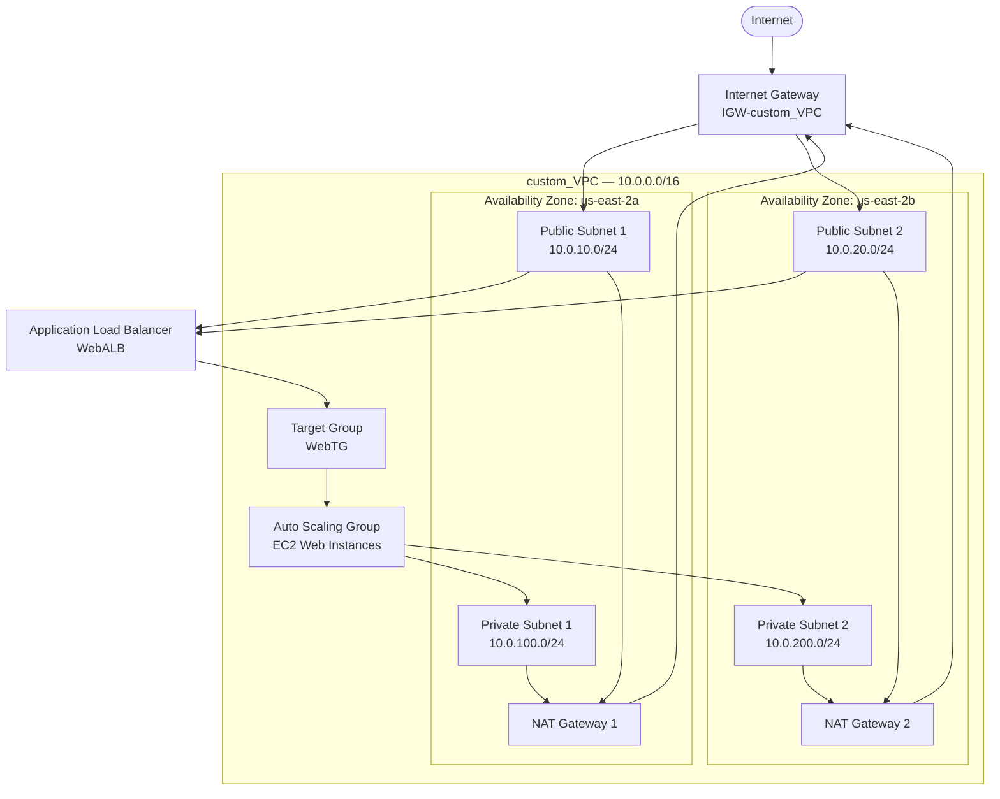

# Multi-Tier AWS Infrastructure with Terraform

This repository contains Terraform code that provisions a **highly available, multi-tier web application infrastructure** on AWS. It builds a custom VPC with public and private subnets, NAT-based outbound connectivity, an Application Load Balancer, and an Auto Scaling Group of EC2 instances managed via AWS Systems Manager (SSM) — no SSH key pairs required.

---

## Architecture Overview



**Traffic flow:** Internet → Internet Gateway → ALB (public subnets) → Target Group → EC2 instances (private subnets, Auto Scaling Group). Outbound traffic from the private subnets (e.g., patching, SSM communication) routes through the NAT Gateways back out via the Internet Gateway.

---

## Resources Provisioned

### 1. Networking (VPC, Subnets, Routing)
| Resource | Name | Details |
|---|---|---|
| VPC | `custom_VPC` | CIDR `10.0.0.0/16`, DNS hostnames enabled |
| Internet Gateway | `IGW-custom_VPC` | Attached to the VPC |
| Public Subnet 1 | `public subnet 1` | `10.0.10.0/24` — AZ `us-east-2a` |
| Public Subnet 2 | `public subnet 2` | `10.0.20.0/24` — AZ `us-east-2b` |
| Private Subnet 1 | `Private_Subnet1` | `10.0.100.0/24` — AZ `us-east-2a` |
| Private Subnet 2 | `Private_Subnet2` | `10.0.200.0/24` — AZ `us-east-2b` |
| Public Route Table | `Public_RT` | Default route `0.0.0.0/0` → Internet Gateway |
| Private Route Table 1 | `Private_RT_1` | Default route `0.0.0.0/0` → NAT Gateway 1 |
| Private Route Table 2 | `Private_RT_2` | Default route `0.0.0.0/0` → NAT Gateway 2 |

### 2. NAT Gateways
- Two Elastic IPs (`EIP1`, `EIP2`)
- Two NAT Gateways (`NATGW1`, `NATGW2`), one per public subnet/AZ, providing redundant outbound internet access for the private subnets.

### 3. Security Groups
| Security Group | Inbound | Outbound |
|---|---|---|
| `WebSG` | HTTP (port 80) from `0.0.0.0/0` | All traffic allowed |
| `ALBSG` | HTTP (port 80) from `0.0.0.0/0` | All traffic allowed |

### 4. IAM (Instance Profile for SSM)
- **IAM Role:** `EC2_SSM` — trust policy scoped to the EC2 service.
- **Policy Attachment:** `AmazonSSMManagedInstanceCore` — grants Systems Manager access (Session Manager, Run Command, Patch Manager) without needing SSH or bastion hosts.
- **Instance Profile:** `LT_Profile` — attached to the launch template so EC2 instances assume the role automatically.

### 5. Application Load Balancer (ALB)
- **Load Balancer:** `WebALB` — internet-facing, deployed across both public subnets, secured by `ALBSG`.
- **Target Group:** `WebTG` — HTTP on port 80.
- **Listener:** Port 80 (HTTP) forwarding all traffic to `WebTG`.

### 6. Launch Template & Auto Scaling Group
- **Launch Template:** `Web_Launch_Template`
  - AMI: `ami-0ea1cddefe0c4aed5`
  - Instance type: `t2.micro`
  - 8 GB EBS volume (`/dev/sdf`)
  - IMDSv2 enforced (`http_tokens = required`)
  - Detailed monitoring enabled
  - Bootstraps via `web.sh` (passed as `user_data`)
  - Uses `WebSG` and the `LT_Profile` instance profile
- **Auto Scaling Group:** `ASG`
  - Deployed in the private subnets
  - `min_size = 1`, `desired_capacity = 2`, `max_size = 4`
  - Registered with the `WebTG` target group for health checks and traffic distribution

### 7. Outputs
| Output | Description |
|---|---|
| `alb_dns` | Public DNS name of the ALB — use this to access the application in a browser |

---

## Repository Structure

```
.
├── main.tf          # All Terraform resources described above
├── web.sh           # User-data bootstrap script run on instance launch (required)
└── README.md        # This file
```

> **Note:** The launch template references `web.sh` via `filebase64("${path.module}/web.sh")`. Ensure this file exists in the same directory as `main.tf` before running `terraform apply`.

---

## Prerequisites

- [Terraform](https://developer.hashicorp.com/terraform/downloads) >= 1.3
- An AWS account with sufficient permissions to create VPC, EC2, IAM, and ELB resources
- AWS credentials configured locally (via `aws configure`, environment variables, or an assumed IAM role)
- An AWS provider block declared in your configuration (not included in the resource file), for example:

```hcl
provider "aws" {
  region = "us-east-2"
}
```

---

## Usage

1. Clone the repository:
   ```bash
   git clone https://github.com/<your-username>/<your-repo>.git
   cd <your-repo>
   ```

2. Initialize Terraform:
   ```bash
   terraform init
   ```

3. Review the execution plan:
   ```bash
   terraform plan
   ```

4. Apply the configuration:
   ```bash
   terraform apply
   ```

5. Once complete, retrieve the ALB DNS name from the output and test it in a browser:
   ```bash
   terraform output alb_dns
   ```

6. Tear down the infrastructure when finished:
   ```bash
   terraform destroy
   ```

---

## Security & Cost Notes

- Instance access is managed exclusively through **AWS Systems Manager Session Manager** (via the `EC2_SSM` role) — no SSH key pairs or open port 22 are required.
- Both security groups currently allow inbound HTTP (port 80) from `0.0.0.0/0`. Restrict this further (e.g., limit `WebSG` to only accept traffic from `ALBSG`) for production hardening.
- Two NAT Gateways and an Application Load Balancer incur hourly AWS charges in addition to data processing fees — remember to run `terraform destroy` after testing to avoid unnecessary costs.
- EC2 instances enforce **IMDSv2** (`http_tokens = required`) to reduce SSRF/metadata-exposure risk.

---

## License

This project is provided as-is for educational and demonstration purposes. Add a license of your choice (e.g., MIT) if distributing publicly.